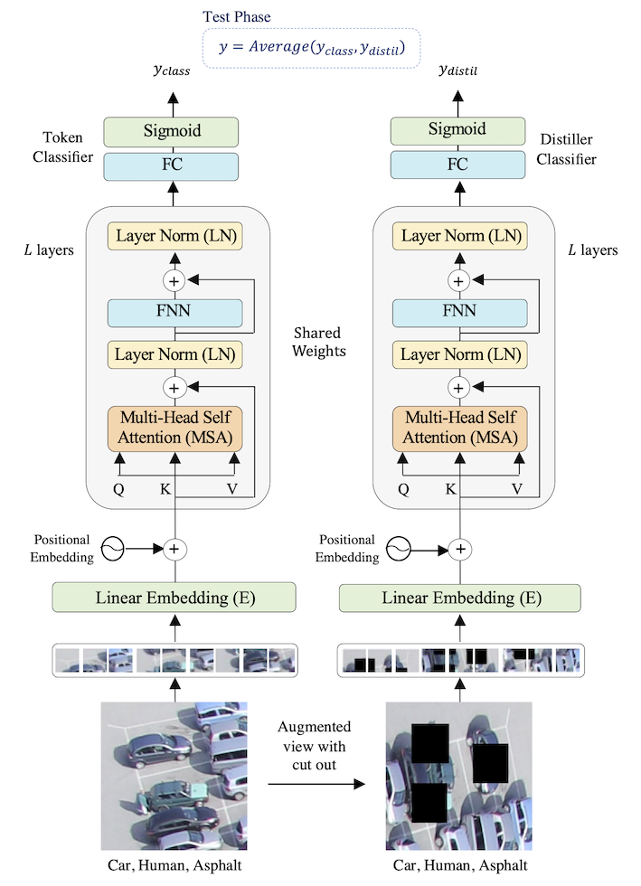

# UAV-image-multilabeling

## Overview
This repository contains the code for the UAV image multilabeling model described in this paper: <a href="https://www.mdpi.com/2076-3417/11/9/3974/xml"> "UAV Image Multi-Labeling with Data-Efficient Transformers"</a> by Laila Bashmal, Yakoub Bazi, Mohamad Mahmoud Al Rahhal, Haikel AlHichri, and Naif Alajlan.

In this paper, we present an approach for the multi-label classification of remote sensing images based on data-efficient transformers. During the training phase, we generated a second view for each image from the training set using data augmentation. Then, both the image and its augmented version were reshaped into a sequence of flattened patches and then fed to the transformer encoder. The latter extracts a compact feature representation from each image with the help of a self-attention mechanism, which can handle the global dependencies between different regions of the high-resolution aerial image. On the top of the encoder, we mounted two classifiers, a token and a distiller classifier. During training, we minimized a global loss consisting of two terms, each corresponding to one of the two classifiers. In the test phase, we considered the average of the two classifiers as the final class labels. Experiments on two datasets acquired over the cities of Trento and Civezzano with a ground resolution of two-centimeter demonstrated the effectiveness of the proposed model.

## Model Architecture

## Dataset

Trento and Civezzano UAV datasets are not included in this project, as they are owned by other parties. However, you can prepare your own data or try the code with <a href="https://bigearth.eu/datasets.html"> UC-Merced Multilabel Dataset</a> or <a href="https://github.com/Hua-YS/AID-Multilabel-Dataset">AID Multilabel Dataset</a>.

## To run

1. Clone the data-efficient transformers (deit) model
<code> !git clone https://github.com/facebookresearch/deit.git </code>

2. Install Vision Transformer (vit) model 
<code> !pip install --upgrade pytorch-pretrained-vit </code>

3. Replace the <code> 'pytorch_pretrained_vit/transformer.py' </code> and the <code> 'pytorch_pretrained_vit/model.py' </code> files with the files included in the repository.

4. Run <code> UAV_image_multilabeling_Transformer.py </code>

## To cite
<code>
@Article{app11093974,
  AUTHOR = {Bashmal, Laila and Bazi, Yakoub and Al Rahhal, Mohamad Mahmoud and Alhichri, Haikel and Al Ajlan, Naif},
  TITLE = {UAV Image Multi-Labeling with Data-Efficient Transformers},
  JOURNAL = {Applied Sciences},
  VOLUME = {11},
  YEAR = {2021},
  NUMBER = {9},
  ARTICLE-NUMBER = {3974},
  URL = {https://www.mdpi.com/2076-3417/11/9/3974},
  ISSN = {2076-3417},
  DOI = {10.3390/app11093974}
}
</code>
